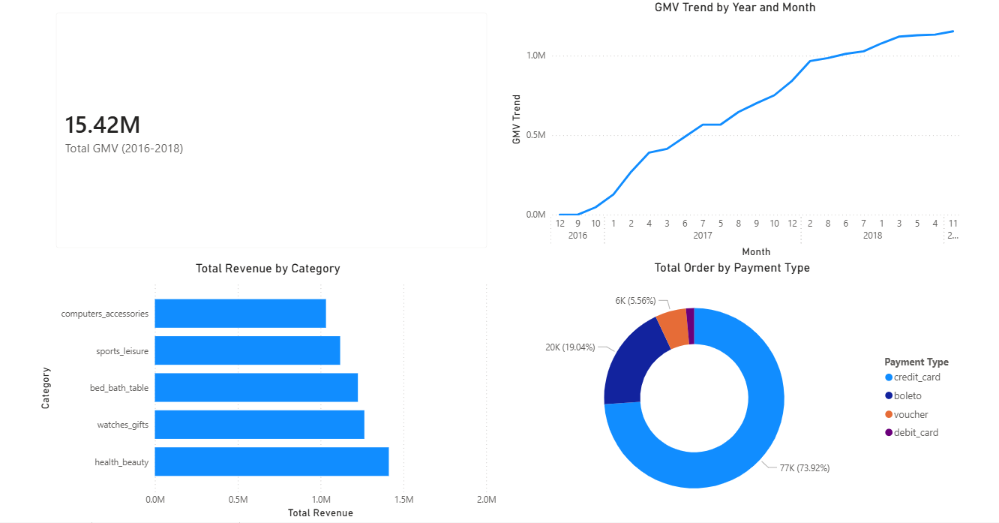
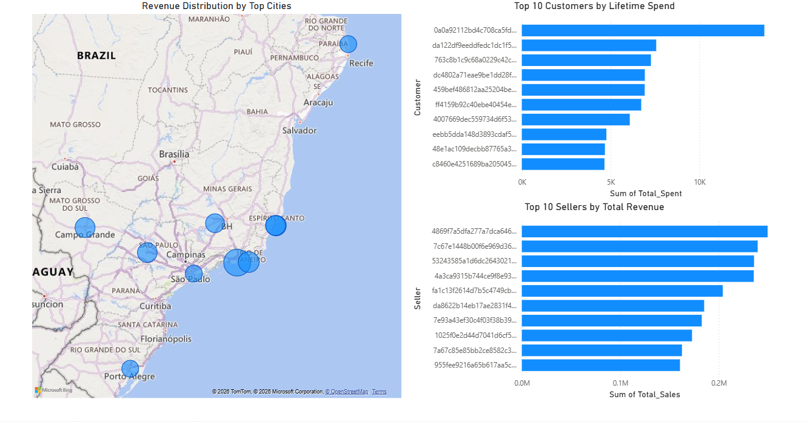
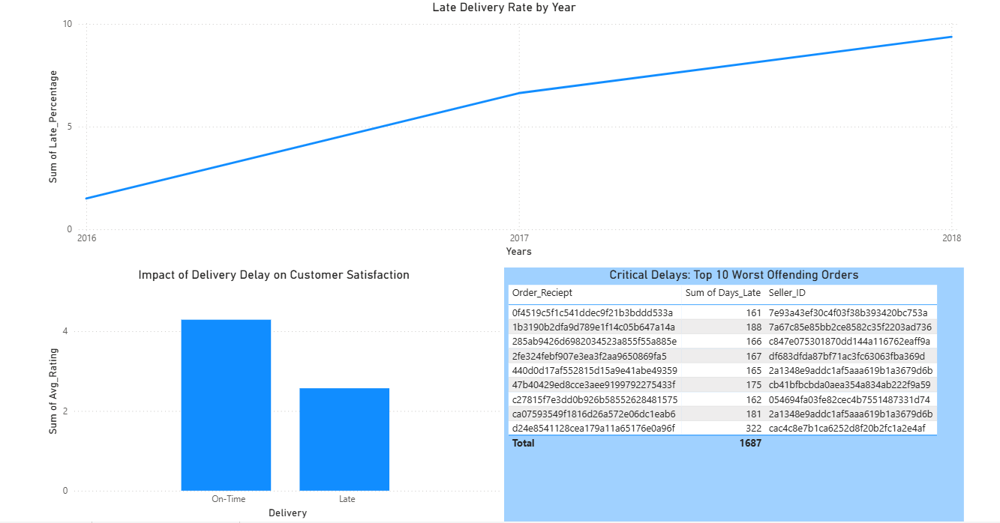

# Olist E-Commerce Marketplace Analysis (SQL + Power BI)

## Project Overview
This project analyzes the Olist Brazilian E-Commerce dataset to explore sales performance, customer behavior, seller performance, and logistics efficiency.

SQL was used to query and analyze the dataset, while Power BI was used to build interactive dashboards that visualize key business insights.

## Tools Used
- SQL Server
- Power BI
- Olist E-Commerce Dataset (Kaggle)

## Key Analysis
The analysis focuses on several important business metrics:

- Total GMV (Gross Merchandise Value)
- Monthly Sales Trends
- Top Product Categories by Revenue
- Customer Purchase Behavior
- Seller Performance and Ratings
- Late Delivery Analysis
- Payment Method Distribution

## Dashboard Preview

### Sales Dashboard

### Customers & Sellers Dashboard

### Logistics Dashboard

## Project Files
- SQL analysis queries
- Power BI dashboard
- Dashboard screenshots
